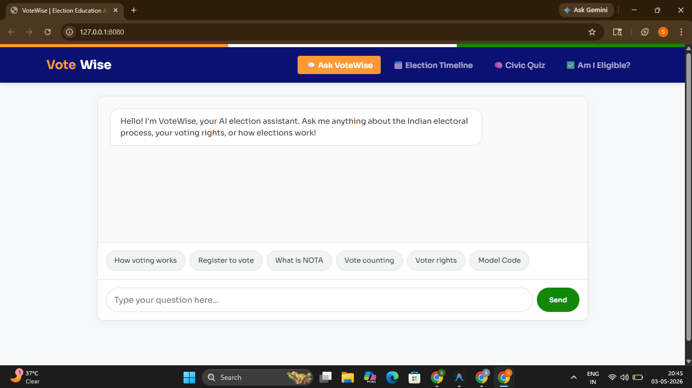
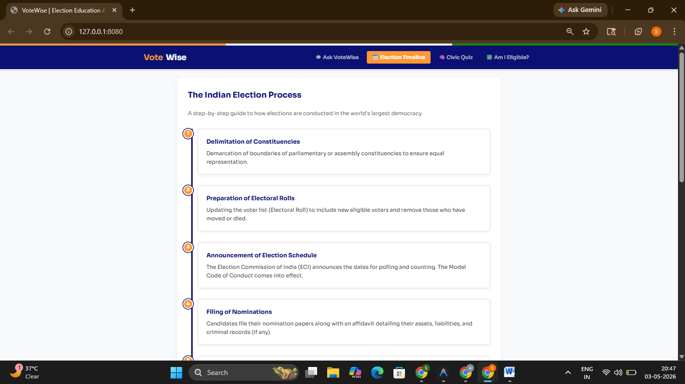
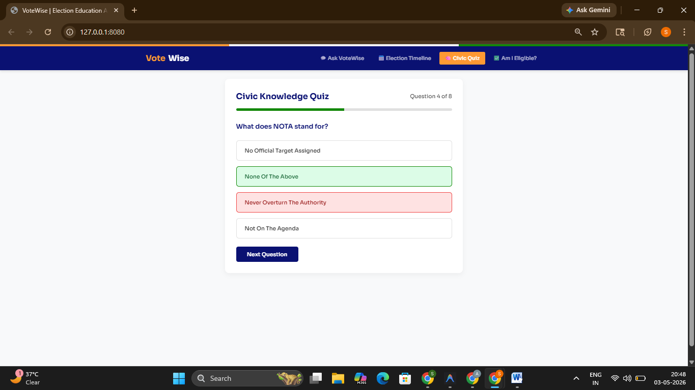
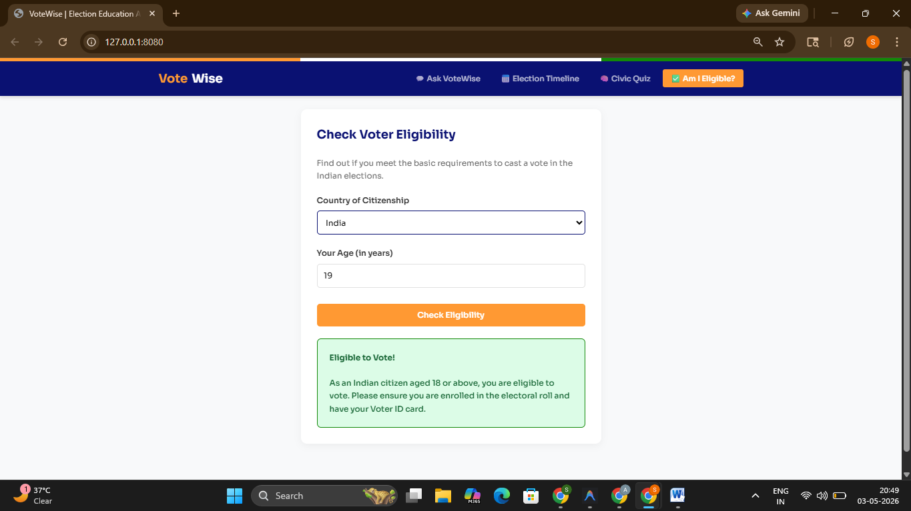

# 🗳️ VoteWise AI — Election Education Assistant

> An AI-powered interactive assistant that helps citizens understand the election process, voter rights, timelines, and civic duties.

<div align="center">
  <a href="https://votewise-ai-1074455053915.us-central1.run.app/">
    
  </a>
</div>
<br/>

[](https://cloud.google.com/run)
[](https://ai.google.dev)


---

## 🎯 Problem Statement
Millions of eligible voters don't participate in elections simply because 
they don't understand the process. VoteWise AI solves this by making 
election education interactive, accessible, and AI-powered.

---

## 🎯 Chosen Vertical

**Election Process Education** — Making the election process accessible, understandable, and engaging for every citizen through an interactive AI assistant.

---

## 💡 Approach & Logic

VoteWise AI combines **Google Gemini's language capabilities** with structured civic education content to create a multi-feature educational platform:

### 1. 💬 AI Chatbot (Ask VoteWise)
- Powered by **Gemini 1.5 Flash** with a detailed election-education system prompt
- Maintains conversation history for contextual follow-up questions
- Covers: voter registration, EVM usage, MCC, NOTA, constituency boundaries, results, government formation

### 2. 📅 Election Timeline
- Visual step-by-step breakdown of the Indian General Election process
- 11 stages: Announcement → MCC → Nomination → Scrutiny → Campaign → Silence Period → Polling → Counting → Results → Government Formation

### 3. 🧠 Civic Quiz
- 8 carefully crafted questions on Indian election fundamentals
- Instant feedback with explanations after each answer
- Score tracking and performance evaluation

### 4. ✅ Voter Eligibility Checker
- User inputs age and country
- Gemini API generates country-specific eligibility information
- Covers required documents, registration steps, and deadlines

---

## 🧠 Prompt Engineering (How Gemini AI is Used)
- System prompt restricts Gemini strictly to election education topics
- Conversation history is passed with every request for context-aware replies
- Eligibility checker uses country-specific dynamic prompts
- Prompts are designed to keep responses neutral, factual, and beginner-friendly
- Example system prompt excerpt:
```text
You are VoteWise AI, an expert Election Education Assistant 
for Indian voters. You ONLY answer questions related to:
- Indian election process, ECI, EVMs, VVPAT
- Voter registration, EPIC cards, Form 6
- Model Code of Conduct, NOTA, election phases
- Voter rights and responsibilities

Keep answers concise, factual, and friendly. 
Use simple language suitable for first-time voters.
Always encourage democratic participation.
If asked anything unrelated, politely redirect to election topics.
```

---

## 🛠️ Tech Stack

| Layer | Technology |
|---|---|
| Backend | Python + Flask |
| AI | Google Gemini 1.5 Flash API |
| Google Service | Google Sheets API (interaction logging) |
| Deployment | Google Cloud Run |
| Container | Docker |
| Frontend | HTML5 + CSS3 + Vanilla JS |

---

## ☁️ Google Services Used
| Service | How It's Used |
|---|---|
| Gemini 2.0 Flash | AI chatbot + eligibility checker |
| Google Cloud Run | Serverless deployment |
| Google Cloud Build | Container build pipeline |
| Google Fonts (Sora) | Typography |
| Google Analytics GA4 | Usage tracking |
| Google Artifact Registry | Docker image storage |

---

## 🚀 How It Works

```
User → Frontend UI → Flask API → Gemini 1.5 Flash → Response
                              ↓
                    Google Sheets (logs Q&A)
```

1. User interacts via one of 4 modules (Chat, Timeline, Quiz, Eligibility)
2. Chat queries are sent to the Flask backend
3. Backend forwards chat prompts to Gemini API with an election-education system prompt
4. Response is returned and displayed in real-time
5. Timeline, Quiz, and basic Eligibility checks run client-side for a seamless, instant UI experience
6. Interactions are optionally logged to Google Sheets for analytics

---

## 📦 Project Structure

```
votewise-ai/
├── app.py              # Flask backend with Gemini + Sheets integration
├── test_app.py         # Unit tests using Pytest
├── requirements.txt    # Python dependencies
├── Dockerfile          # Container config for Cloud Run
├── .env.example        # Environment variable template
├── .gitignore          # Git ignore file
├── templates/
│   └── index.html      # Full frontend (single-file, no framework)
└── README.md
```

---

## ⚙️ Environment Variables

```bash
GEMINI_API_KEY=your_gemini_api_key_here
GOOGLE_SHEET_ID=optional_sheet_id_for_logging
GOOGLE_SHEETS_CREDS=optional_service_account_json
PORT=8080
```

---

## 📸 Screenshots

<table>
  <tr>
    <td align="center" width="50%">
      
      <br/>
      <b>💬 Ask VoteWise</b>
      <br/>
      <sub>AI-powered chatbot for all election queries</sub>
    </td>
    <td align="center" width="50%">
      
      <br/>
      <b>📅 Election Timeline</b>
      <br/>
      <sub>11-step visual guide to the Indian election process</sub>
    </td>
  </tr>
  <tr>
    <td align="center" width="50%">
      
      <br/>
      <b>🧠 Civic Quiz</b>
      <br/>
      <sub>8-question interactive quiz with live scoring</sub>
    </td>
    <td align="center" width="50%">
      
      <br/>
      <b>✅ Am I Eligible?</b>
      <br/>
      <sub>Instant voter eligibility checker by age & country</sub>
    </td>
  </tr>
</table>

---

## 🏃 Running Locally

```bash
# Clone the repo
git clone https://github.com/shaikasadahmed2k23/votewise-ai.git
cd votewise-ai

# Install dependencies
pip install -r requirements.txt

# Set environment variables
export GEMINI_API_KEY=your_key_here

# Run
python app.py
# Visit: http://localhost:8080
```

---

## ☁️ Deploying to Cloud Run

```bash
# Build and push to Artifact Registry
gcloud builds submit --tag gcr.io/YOUR_PROJECT_ID/votewise-ai

# Deploy to Cloud Run
gcloud run deploy votewise-ai \
  --image gcr.io/YOUR_PROJECT_ID/votewise-ai \
  --platform managed \
  --region us-central1 \
  --allow-unauthenticated \
  --set-env-vars GEMINI_API_KEY=your_key
```

---

## 📋 Assumptions

- Default election context is **India (ECI system)** unless user specifies another country
- The chatbot is educational only — it remains politically neutral at all times
- Google Sheets logging is optional; the app works fully without it
- Quiz questions are focused on Indian elections but the chatbot covers global election systems

---

## ♿ Accessibility Features
- **ARIA Labels:** Applied across all interactive elements (buttons, inputs, quick-chips).
- **Screen Reader Support:** Implemented `role="log"` and `aria-live="polite"` on chat containers for dynamic response reading.
- **Form Descriptions:** Used `aria-describedby` on eligibility inputs to guide visually impaired users.
- **Keyboard Navigation:** Fully supported Tab indexing and Enter key handling across all tabs.
- **High Contrast:** Tailored Indian flag color scheme ensuring optimal legibility.

---

## ✨ UI & Efficiency Polish
- **Debounced Interactions:** "Send" button debouncing prevents accidental double API calls, saving rate limits.
- **Smart Loading States:** Interactive skeleton-style spinner provides immediate feedback during AI generation.
- **Dynamic Quiz Explanations:** Explanations dynamically animate in post-answer without refreshing the state.
- **Data Caching:** Quiz data and DOM states are cached to ensure zero-lag switching between tabs.
- **Error Recovery:** Intuitive error handling with built-in "Retry" capabilities on network failure.
- **One-Click Copy:** Native copy-to-clipboard functionality added directly to AI response bubbles.

---

## 🔐 Security
- API keys in environment variables only — never in code
- .env in .gitignore — never pushed to GitHub
- Input validation on all Flask endpoints
- CORS properly configured
- No sensitive data stored client-side

---

## 🧪 Testing

```bash
# Run unit tests locally with pytest
pytest test_app.py

# Alternatively, run tests using Python directly
python test_app.py

# Test health endpoint on Cloud Run
curl https://YOUR_CLOUD_RUN_URL/api/health

# Test chat endpoint
curl -X POST https://YOUR_CLOUD_RUN_URL/api/chat \
  -H "Content-Type: application/json" \
  -d '{"message": "How do I register to vote in India?", "history": []}'

# Test eligibility endpoint
curl -X POST https://YOUR_CLOUD_RUN_URL/api/eligibility \
  -H "Content-Type: application/json" \
  -d '{"age": 20, "country": "India"}'
```

---

## 👨‍💻 Author

**Shaik Asad Ahmed**  
B.Tech Computer Science (AI) 
GitHub: [@shaikasadahmed2k23](https://github.com/shaikasadahmed2k23)

---

*Built with ❤️ for Prompt Wars Hackathon — Google Developer Groups*
